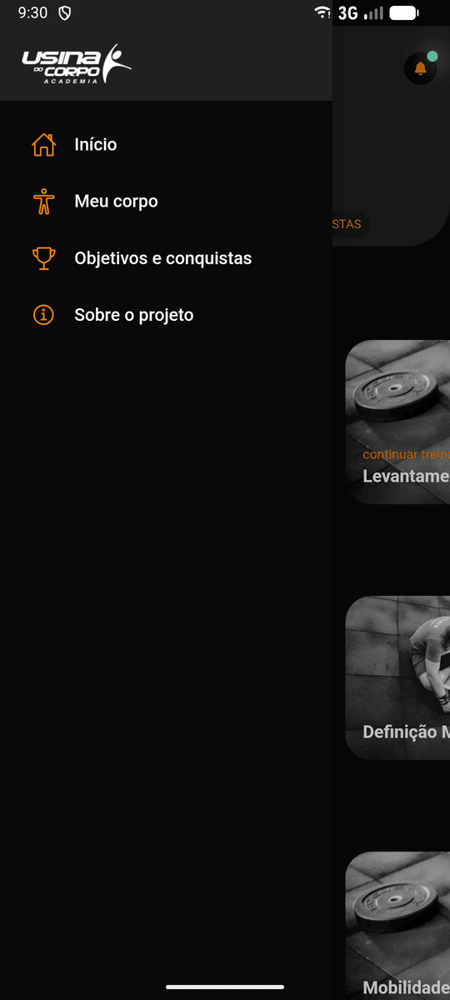
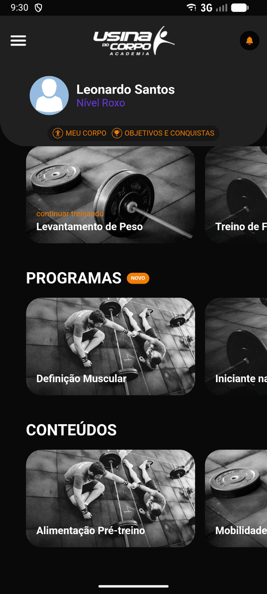
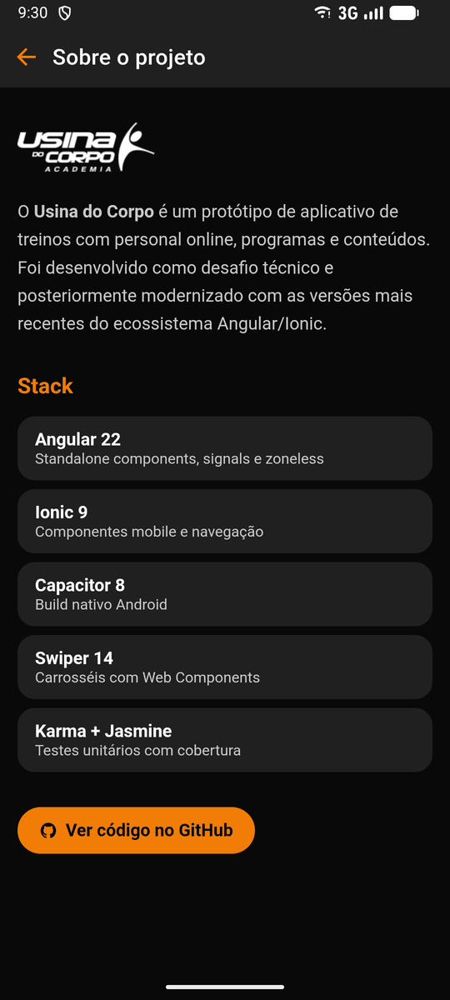

<div align="center">


# Usina do Corpo

**App mobile de treinos com personal online, programas e conteúdos — feito com Ionic, Angular e Capacitor.**

[](https://github.com/Bizzye/usinaDoCorpo/actions/workflows/ci.yml)
[](https://github.com/Bizzye/usinaDoCorpo/actions/workflows/deploy-web.yml)
[](https://github.com/Bizzye/usinaDoCorpo/releases/latest)
[](https://github.com/Bizzye/usinaDoCorpo/actions/workflows/codeql.yml)


[**📱 Baixar APK**](https://github.com/Bizzye/usinaDoCorpo/releases/latest/download/usina-do-corpo.apk) ·
[**🌐 Ver demo web**](https://usina-do-corpo.web.app) ·
[**📦 Releases**](https://github.com/Bizzye/usinaDoCorpo/releases)

</div>

---

## 📖 Sobre o projeto

O **Usina do Corpo** nasceu como um **desafio técnico para a Be220**: transformar o layout de um app de academia em uma aplicação Ionic funcional. Depois do processo seletivo o projeto foi **modernizado para portfólio**, recebendo:

- atualização completa do stack (Angular 17 → **22**, Ionic 7 → **9**, Capacitor 5 → **8**);
- code review de boas práticas (arquitetura, signals, acessibilidade, segurança);
- testes unitários com **Karma + Jasmine** e **100% de cobertura**;
- pipeline de **CI/CD** com GitHub Actions: lint, testes, build, deploy no Firebase Hosting e publicação do APK assinado.

## 📸 Screenshots

<div align="center">

|                                  Home                                  |                                       Notificações                                        |                              Menu lateral                              |
| :--------------------------------------------------------------------: | :---------------------------------------------------------------------------------------: | :--------------------------------------------------------------------: |
|  |  |  |

|                                        Carrosséis                                        |                                                  Em breve                                                   |                                  Sobre o projeto                                  |
| :--------------------------------------------------------------------------------------: | :---------------------------------------------------------------------------------------------------------: | :-------------------------------------------------------------------------------: |
|  |  |  |

</div>

## 📱 Instalando o app (Android)

1. No celular, baixe o APK: **[usina-do-corpo.apk](https://github.com/Bizzye/usinaDoCorpo/releases/latest/download/usina-do-corpo.apk)**
2. Abra o arquivo baixado. Se o Android pedir, permita **"Instalar apps desconhecidos"** para o navegador/gerenciador de arquivos.
3. Toque em **Instalar** e abra o **Usina do Corpo**.

> Requer Android 7.0 (API 24) ou superior. O APK é assinado com a chave de release do projeto e o hash SHA-256 é publicado junto com cada [release](https://github.com/Bizzye/usinaDoCorpo/releases).

Prefere testar sem instalar nada? Acesse a **[versão web](https://usina-do-corpo.web.app)** pelo celular ou no modo responsivo do navegador.

## ✨ Funcionalidades

- **Header** com avatar, nível do usuário (cor dinâmica), atalhos e logo.
- **Notificações** com indicador de não lidas, fechamento por clique fora/`Esc` e estados de vazio/erro.
- **Menu lateral** (`ion-menu`) com navegação.
- **Carrosséis** de Personal Online, Programas e Conteúdos com Swiper Web Components.
- **Skeletons** de carregamento, estado de erro com _retry_ e _toast_ de "em breve" para funcionalidades ainda não implementadas.
- Página **Sobre o projeto** com a stack utilizada.
- Dados servidos por **JSON mockado** (`src/assets/data`), consumidos via `HttpClient` — trocar por uma API real exige só alterar o token `API_BASE_URL`.

## 🧱 Stack

| Camada    | Tecnologia                                                                             |
| --------- | -------------------------------------------------------------------------------------- |
| Framework | Angular 22 (standalone, **zoneless**, signals, `rxResource`, control flow)             |
| UI mobile | Ionic 9 (componentes standalone) + Ionicons 8                                          |
| Nativo    | Capacitor 8 (Android, edge-to-edge com `SystemBars`)                                   |
| Carrossel | Swiper 14 (Web Components, carregado sob demanda)                                      |
| Testes    | Karma + Jasmine + `HttpTestingController` + `RouterTestingHarness`                     |
| Qualidade | ESLint 10 (flat config, angular-eslint, regras de a11y), Prettier, Husky + lint-staged |
| CI/CD     | GitHub Actions, Firebase Hosting, GitHub Releases, CodeQL, Dependabot                  |

## 🏗️ Arquitetura

```
src/
├── app/
│   ├── core/                  # regras e dados (sem UI)
│   │   ├── models/            # contratos tipados (readonly)
│   │   ├── services/          # Content, Notification, Session e Navigation
│   │   └── tokens/            # API_BASE_URL (InjectionToken)
│   ├── layout/                # shell: header (nav, notificações, perfil) e menu
│   ├── shared/components/     # componentes de apresentação reutilizáveis (card)
│   ├── pages/                 # páginas lazy-loaded (home, about)
│   ├── app.config.ts          # providers (router, http, ionic)
│   └── app.routes.ts          # rotas com loadComponent + títulos
├── assets/data/               # mocks JSON da "API"
├── testing/                   # fixtures e test doubles compartilhados
└── theme/                     # tokens de design e tema Ionic
```

**Padrões e decisões**

- **Container / Presentational** — `CardComponent` só renderiza e emite `selected`; quem decide a navegação é a página.
- **Repository + DI token** — services encapsulam o acesso a dados; `API_BASE_URL` permite trocar mocks por backend real sem tocar nos componentes.
- **Facade de navegação** — `NavigationService` centraliza rotas internas, links externos e o feedback de "em breve".
- **Signals + `rxResource`** — estados de _loading_, erro e sucesso declarativos, sem `subscribe` manual.
- **`OnPush` + zoneless** em todos os componentes (regra de lint obrigatória).
- **Lazy loading** de páginas, imagens (WebP) e do Swiper (fora do bundle inicial).

## 🔐 Segurança

- **CSP** no `index.html` e headers HTTP no Firebase (`HSTS`, `X-Frame-Options`, `nosniff`, `Referrer-Policy`, `Permissions-Policy`).
- Links externos validados (só `http/https`) e abertos com `noopener,noreferrer` — evita _reverse tabnabbing_ e `javascript:` URLs.
- Cor do nível vinda da API **validada** (hex) antes de ir para o DOM.
- Fontes **self-hosted** (`@fontsource/roboto`) — sem requisições a CDNs de terceiros.
- Android: `allowBackup=false`, sem _mixed content_, WebView debugging apenas em builds de debug, build release com R8.
- Keystore de assinatura **fora do repositório**, injetado no CI via _secrets_.
- `npm audit` no pipeline, CodeQL semanal e Dependabot agrupado.

## ✅ Qualidade e testes

```bash
npm run test:ci   # Karma (ChromeHeadless) + cobertura
```

- **66 testes**, **100%** de statements, branches, functions e lines.
- Thresholds de cobertura no `karma.conf.js` (o build quebra abaixo de 80%).
- Services testados com `HttpTestingController`; rotas com `RouterTestingHarness`; componentes com `ComponentFixture` (zoneless).
- Testes de segurança: bloqueio de URLs `javascript:`/`data:` e sanitização de cores.

## 🚀 CI/CD

| Workflow                                             | Gatilho             | O que faz                                                                       |
| ---------------------------------------------------- | ------------------- | ------------------------------------------------------------------------------- |
| [`ci.yml`](.github/workflows/ci.yml)                 | push / PR           | audit → prettier → eslint → testes + cobertura → build → APK debug (artefato)   |
| [`deploy-web.yml`](.github/workflows/deploy-web.yml) | push na `main` / PR | build e deploy no **Firebase Hosting** (canal `live` na main, _preview_ por PR) |
| [`release.yml`](.github/workflows/release.yml)       | tag `v*.*.*`        | testes → build → **APK assinado** → GitHub Release com `.apk` + `.sha256`       |
| [`codeql.yml`](.github/workflows/codeql.yml)         | push / PR / semanal | análise estática de segurança                                                   |

Para publicar uma nova versão do APK:

```bash
git tag v1.0.0 && git push origin v1.0.0
```

<details>
<summary><b>Secrets e variáveis necessários no GitHub</b></summary>

| Nome                        | Tipo   | Uso                                          |
| --------------------------- | ------ | -------------------------------------------- |
| `FIREBASE_SERVICE_ACCOUNT`  | secret | JSON da service account do Firebase (deploy) |
| `ANDROID_KEYSTORE_BASE64`   | secret | keystore de release em base64                |
| `ANDROID_KEYSTORE_PASSWORD` | secret | senha do keystore                            |
| `ANDROID_KEY_ALIAS`         | secret | alias da chave                               |
| `ANDROID_KEY_PASSWORD`      | secret | senha da chave                               |

</details>

## 🛠️ Rodando localmente

**Pré-requisitos:** Node.js 24+ (veja `.nvmrc`). Para Android: JDK 21 e Android SDK (API 36).

```bash
git clone https://github.com/Bizzye/usinaDoCorpo.git
cd usinaDoCorpo
npm install
npm start                # http://localhost:4200
```

| Script                            | Descrição                                 |
| --------------------------------- | ----------------------------------------- |
| `npm start`                       | servidor de desenvolvimento               |
| `npm run build`                   | build de produção em `www/`               |
| `npm test` / `npm run test:ci`    | testes (watch / headless + cobertura)     |
| `npm run lint` / `npm run format` | ESLint / Prettier                         |
| `npm run android:run`             | build + roda no emulador/dispositivo      |
| `npm run android:open`            | abre o projeto no Android Studio          |
| `npm run android:apk`             | gera o APK debug                          |
| `npm run deploy:web`              | build + deploy manual no Firebase Hosting |

## 📄 Licença

Distribuído sob a licença MIT. Imagens e marca "Usina do Corpo" pertencem aos seus respectivos donos e são usadas apenas para fins de demonstração.

---

<div align="center">
Feito por <a href="https://github.com/Bizzye">Bizarro</a>
</div>
